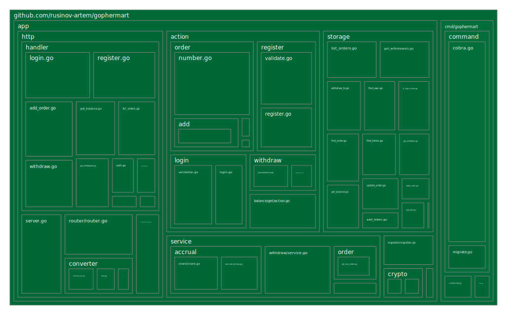

# gophermart

Это дипломный проект курса ["Go-разработчик" Яндекс.Практикум](https://practicum.yandex.ru/go-advanced/?from=catalog)

Основная цель проекта - тренеровка навыка TDD, coverage 100%

При этом хотелось посмотреть на сколько это будет удобно\неудобно использовать только
самописные test doubles

Разработку вел руководствуясь идеями из книги [growing object oriented software guided by tests](https://www.oreilly.com/library/view/growing-object-oriented-software/9780321574442/) 
и [видео](https://cleancoders.com/series/comparativeDesign)

[Задание находится тут](SPECIFICATION.md)

# Общие сведения

Основные команды которые нужны для разработки находятся в Makefile

`make up` - запуск проекта

`make down` - остановка

`make down-v` - остановка c очисткой бд

`make clean` - полностью очистить все

`make @test` - запуск тестов.

`make @ci-lint` - запуск линтера

Запуск тестов через `make @test` хорошо подходит для одноразового запуска. Например, в pipeline. Но в процессе разработки
удобнее зайти в контейнер `make bash` и запускать тесты внутри контейнера, не выходя из него `make test`.
Так тесты будут отрабатывать чуть быстрее, т.к. не будет каждый раз происходить полной перекомпиляции всего, будет задействован кэш

